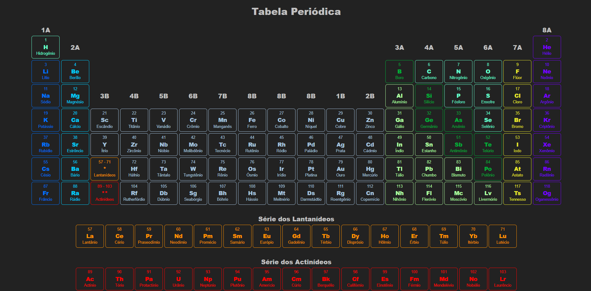

<h1 align="center">👩‍🔬🧪⚗ Tabela Periódica</h1>

<h2 align="center">💬 Descrição</h2>

Este projeto faz parte de uma atividade do curso de Capacitação Tecnológica - Mackenzie/Brasscom, que tive a oportunidade de participar recentemente.  
A proposta da atividade era desenvolver uma tabela periódica utilizando os conceitos de HTML e CSS que foram ensinados no curso.  
Em relação ao **HTML**, foram utilizadas neste projeto, principalmente as tag's &lt;table&gt;, &lt;tr&gt; e &lt;td&gt;, que me possibilitaram estruturar a tabela periódica com linhas e colunas.  
Já em relação ao **CSS**, eu optei por estilizar a minha tabela com um tema 'dark', mas mantive a essência da tabela periódica tradicional, utilizando cores vivas para distinguir os grupos de elementos. Além disso, utilizei o 'hover' para criar uma animação básica de mudança de cor quando o usuário passa o mouse por cima dos elementos.

<strong>Aviso: A página do projeto não é responsiva, por isso, ao executar o projeto na sua máquina, ela pode não se ajustar exatamente ao tamanho da sua tela. Agradeço a compreensão.</strong>

---
  
<h3 align="center">💻 Como executar o projeto</h3>
<ol>
  <li>Faça o download do repositório.</li>
  <li>Extraia o arquivo .zip</li>
  <li>Abra a pasta que foi criada.</li>
  <ul>
    <li>Tenha certeza de que os arquivos '.html' e '.css' estão na mesma pasta.</li>
  </ul>
  <li>Clique duas vezes no arquivo 'index.html' ou clique com o botão direito do mouse e selecione 'Abrir com' para abri o arquivo com o seu navegador.</li>
</ol>

---
